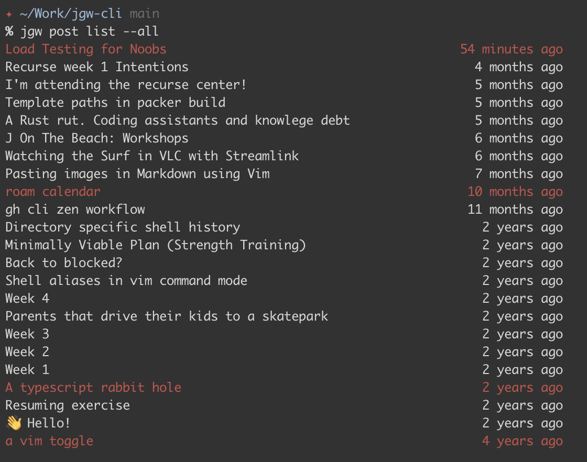

# JGW cli tool

A cli utility to interact with my blog/website. It allows to create, list, ~~delete~~ ~~edit~~ posts.



### Development

It's developed using [TypeScript](https://www.typescriptlang.org) and [Bun](https://bun.sh).

Install dependencies:
```
bun install
```

In order to be able to call the jgw command globally, you need to link it from
the global scope

```
bun run install-global
```

When developing, you can run TypeScript directly without compilation:

```
bun run dev
```

Or execute the TypeScript file directly:
```
./src/index.ts
```


